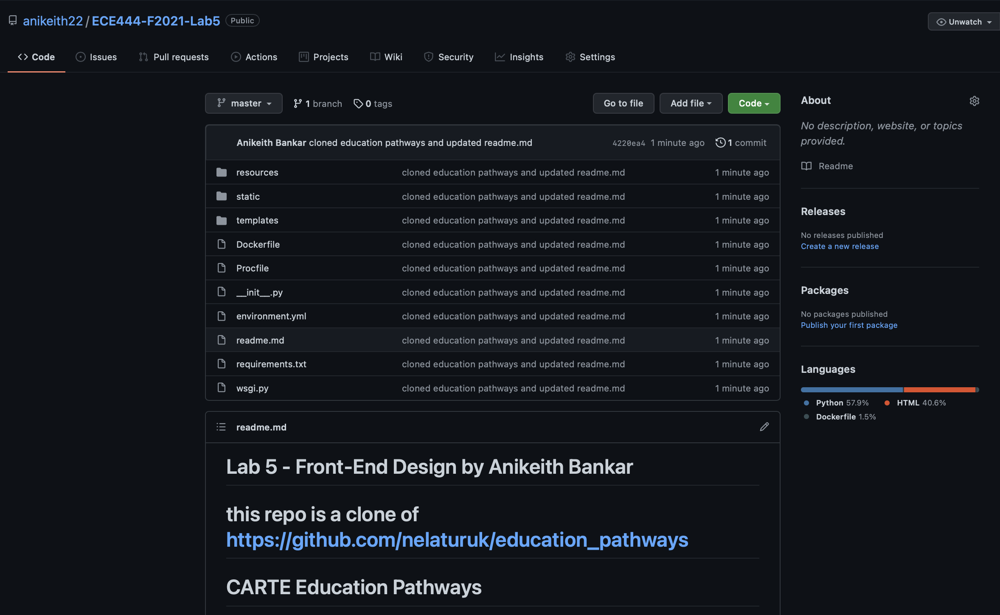
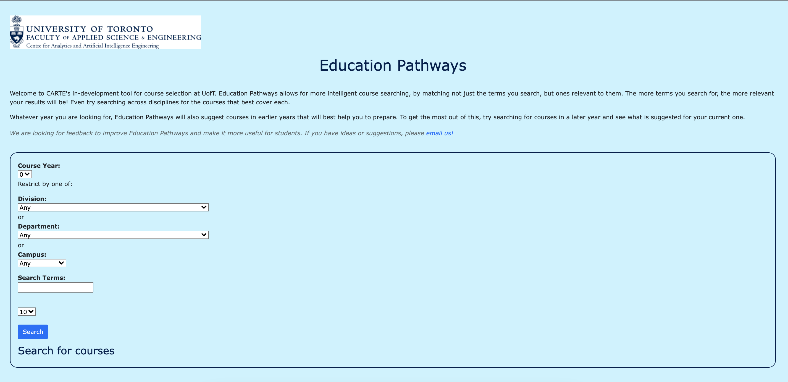
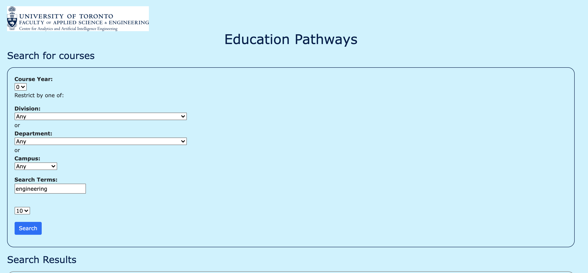
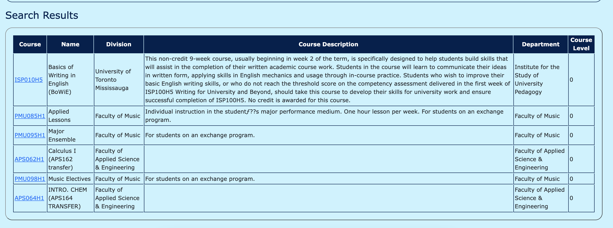

# Lab 5 - Front-End Design by Anikeith Bankar

### This repo is a clone of https://github.com/nelaturuk/education_pathways

# CARTE Education Pathways

## Description
Welcome to CARTE's in-development tool for course selection at UofT. Education Pathways allows for more intelligent course searching, by matching not just the terms you search, but ones relevant to them. The more terms you search for, the more relevant your results will be! Even try searching across disciplines for the courses that best cover each.

Whatever year you are looking for, Education Pathways will also suggest courses in earlier years that will best help you to prepare. To get the most out of this, try searching for courses in a later year and see what is suggested for your current one.

We are looking for feedback to improve Education Pathways and make it more useful for students. If you have ideas or suggestions, please email us!

## Setup Instructions

### With Docker

## Repository files:

`./Procfile ./wsgi.py` *tells gunicorn how to run the program*

`./environment.yml  ./requirements.txt` *specifies python requirements for anaconda and pip respectively*

`./__init__.py` *main flask code*

`./readme.md` *this file*

`./resources:` *contains datasets used in the program*

`course_vectorizer.pickle df_processed.pickle`

`course_vectors.npz       graph.pickle`

`./static:` *contains any static elements of the webpage, in this case just the CARTE logo*
`CARTE_logo.jpg`

`./templates:` *contains flask templates for rendering HTML*

`_formhelpers.html course.html       index.html        results.html`

## Activity 1 - Github Repo

## Activities 2 - 5 - CSS Updated Home Page and Result Page

#### Home Page

#### Results - Form

#### Results - Table

## Activity 6 - Comparison between Old UI and New UI

UI is one of the most important aspects of keeping user retention on a website and bringing them back often. For the Old UI, the text and colours were all set to default without any UI design elements in place like white spacing and padded borders. The new UI atleast centers text, bolds text and gives a cohesive view of the results table that is not just combined with the searching form. One feature I would say of the new UI that I think should be changed, would be the background color to remain white or a slight beige colour, the full page of blue is not ideal for reading text clearly. 

